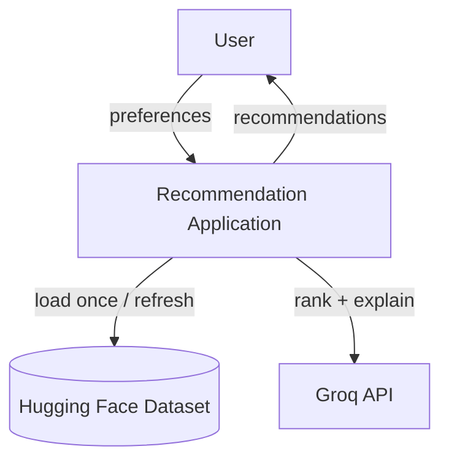
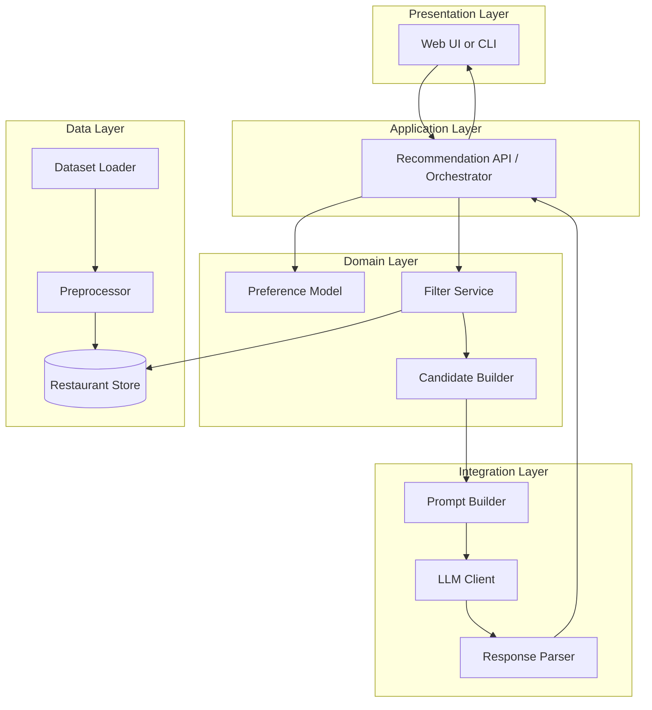
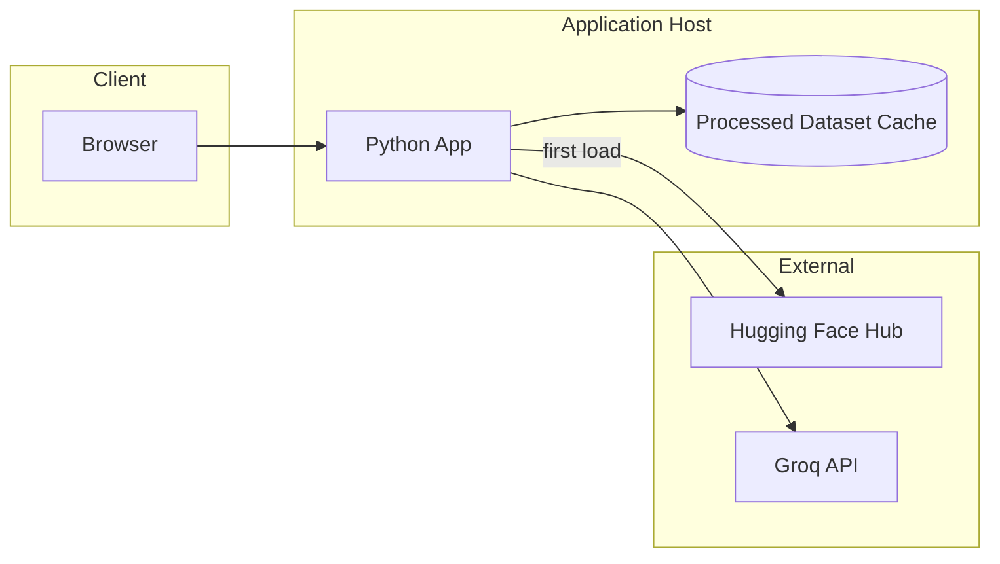

# Architecture — AI-Powered Restaurant Recommendation System

This document defines the technical architecture for the Zomato-inspired recommendation service described in [problemStatement.md](./problemStatement.md). It covers layers, components, data flows, contracts, and operational concerns so the system can be implemented consistently end to end.

---

## 1. Architectural Goals

| Goal | How the architecture supports it |
|------|----------------------------------|
| **Data-grounded** | All LLM inputs are derived from filtered dataset rows; the model does not invent restaurants. |
| **Preference-first** | Hard filters run before any LLM call to shrink candidates and enforce constraints. |
| **Explainable** | LLM output is structured (rank + per-restaurant explanation + optional summary). |
| **Maintainable** | Clear separation: ingestion, domain/filtering, LLM integration, presentation. |
| **Cost-aware** | Cap candidate count sent to the LLM; cache dataset in memory or on disk after first load. |

### Design principles

1. **Single source of truth** — The preprocessed in-memory (or cached) dataset is the authority for names, ratings, costs, and locations.
2. **Fail closed on bad input** — Invalid preferences return validation errors; empty filter results do not call the LLM.
3. **Structured LLM I/O** — Request JSON (or schema-constrained) responses from the LLM to simplify parsing and UI binding.
4. **Idempotent filtering** — Same preferences + same dataset version produce the same candidate set.

---

## 2. System Context



**External dependencies**

| System | Role |
|--------|------|
| [ManikaSaini/zomato-restaurant-recommendation](https://huggingface.co/datasets/ManikaSaini/zomato-restaurant-recommendation) | Source of restaurant records |
| **[Groq](https://groq.com/)** (v1 LLM provider) | Fast inference for ranking and natural-language explanations via OpenAI-compatible chat API |

**v1 LLM choice:** Groq hosts open models (e.g. Llama, Mixtral) with low latency. The app uses the standard `openai` Python SDK pointed at `https://api.groq.com/openai/v1` and a Groq API key from [console.groq.com](https://console.groq.com/). Other OpenAI-compatible providers remain possible via `LLM_BASE_URL` but are not the default.

**In scope:** batch/offline dataset load, preference-based filtering, LLM ranking, results UI or API.  
**Out of scope (v1):** live Zomato API, user accounts, booking, payments (see problem statement).

---

## 3. Logical Architecture (Layers)



### Layer responsibilities

| Layer | Responsibility | Must not |
|-------|----------------|----------|
| **Presentation** | Collect preferences; render ranked results and explanations | Contain filter or prompt logic |
| **Application** | Orchestrate one recommendation request; handle errors and timeouts | Embed raw Hugging Face or HTTP details |
| **Domain** | Validate preferences; filter restaurants; build candidate DTOs | Call LLM directly |
| **Integration** | Build prompts; invoke LLM; parse structured output | Own business rules for budget bands |
| **Data** | Load, clean, normalize, cache dataset | Know about user sessions |

---

## 4. Component Specification

### 4.1 Data Layer

#### Dataset Loader

- Uses `datasets` (Hugging Face) to load `ManikaSaini/zomato-restaurant-recommendation`.
- Runs at **application startup** or on explicit refresh.
- Emits raw rows to the preprocessor.

#### Preprocessor

Transforms raw rows into a canonical **Restaurant** model:

| Field | Type | Notes |
|-------|------|--------|
| `id` | string | Stable hash or dataset index |
| `name` | string | Trimmed, title-cased optional |
| `location` | string | City/area; normalized for case-insensitive match |
| `cuisines` | list[string] | Split multi-value cuisine strings |
| `rating` | float | Parse; drop or flag invalid |
| `cost_for_two` | int or null | INR; map to budget tier |
| `budget_tier` | enum | `low` \| `medium` \| `high` — derived from cost quantiles or fixed thresholds |
| `attributes` | dict | Optional: delivery, dine-in, etc., if present in dataset |

**Normalization rules (configurable constants)**

- Location: lowercase compare, display original casing.
- Cuisine: split on `,`, trim, canonical names (e.g., "North Indian" vs "north indian").
- Rating: coerce to float; exclude rows below data quality threshold if rating missing.
- Budget tiers (example defaults, tune from data distribution):

  | Tier | Cost for two (INR) |
  |------|---------------------|
  | low | ≤ 500 |
  | medium | 501 – 1500 |
  | high | > 1500 |

#### Restaurant Store

- In-memory list or `pandas` DataFrame indexed by `id`.
- Read-only after load.
- Exposes query helpers: `get_all()`, `filter(criteria)`.

Optional: persist preprocessed parquet to `data/processed/` to avoid re-downloading on every run.

---

### 4.2 Domain Layer

#### Preference Model

Input from user (form or API body):

```json
{
  "location": "Bangalore",
  "budget": "medium",
  "cuisine": "Italian",
  "min_rating": 4.0,
  "additional_preferences": ["family-friendly", "quick service"],
  "top_k": 5
}
```

Validation:

| Field | Rules |
|-------|--------|
| `location` | Required; non-empty string |
| `budget` | Required; one of `low`, `medium`, `high` |
| `cuisine` | Optional; if set, substring or token match against `cuisines` |
| `min_rating` | Optional; 0–5 |
| `additional_preferences` | Optional list of strings; used in LLM prompt, soft signals only unless dataset has matching columns |
| `top_k` | Optional; default 5; max cap (e.g., 10) for UI |

#### Filter Service

Applies **hard filters** in sequence (order may affect performance; index by `location` first if large):

1. `location` — case-insensitive equality or contains on city/area field.
2. `budget` — `budget_tier` equals user selection.
3. `cuisine` — any cuisine token matches user cuisine (case-insensitive).
4. `min_rating` — `rating >= min_rating`.

**Output:** ordered or unordered list of `Restaurant` records (0..N).

**Empty result:** return `FilterResult { candidates: [], message: "No restaurants match..." }` — **do not** invoke LLM.

**Large result:** if N > `MAX_CANDIDATES_FOR_LLM` (recommended: 20–30), truncate by highest rating then stable sort by name before sending to LLM.

#### Candidate Builder

Maps filtered `Restaurant` rows to compact objects for the prompt (minimize tokens):

```json
{
  "id": "r_1042",
  "name": "Example Bistro",
  "cuisines": ["Italian", "Continental"],
  "rating": 4.3,
  "cost_for_two": 1200,
  "budget_tier": "medium",
  "location": "Bangalore"
}
```

Include only fields needed for ranking and explanation.

---

### 4.3 Integration Layer

#### Prompt Builder

**System message (intent):** You are a restaurant recommendation assistant. Use only the provided restaurants. Rank by fit to user preferences. Output valid JSON only.

**User message structure:**

1. Serialized user preferences.
2. JSON array of candidate restaurants (with `id`).
3. Instructions: return top `top_k` by fit; explain each; optional one-paragraph summary.

**Expected LLM response schema:**

```json
{
  "summary": "Three strong Italian options in Bangalore within a medium budget...",
  "recommendations": [
    {
      "restaurant_id": "r_1042",
      "rank": 1,
      "explanation": "Matches your Italian preference, 4.3 rating exceeds 4.0, and cost fits medium budget."
    }
  ]
}
```

Constraints in prompt:

- Every `restaurant_id` must exist in the candidate list.
- Do not add restaurants not in the list.
- Rank from 1 (best) upward.

#### LLM Client

- Abstract interface: `complete(system: str, user: str) -> str`.
- **v1 implementation: Groq** — use the `openai` SDK with:
  - `base_url`: `https://api.groq.com/openai/v1` (override via `LLM_BASE_URL` if needed)
  - `api_key`: Groq API key from `LLM_API_KEY`
  - `model`: Groq model id from `LLM_MODEL` (e.g. `llama-3.3-70b-versatile`, `llama-3.1-8b-instant`)
- Configuration via environment: `LLM_PROVIDER=groq`, `LLM_API_KEY`, `LLM_MODEL`, `LLM_BASE_URL` (optional).
- Timeout (e.g., 30s) and retry once on transient errors (rate limits, 5xx).
- Tests use a **mock** `LLMClient`; no Groq calls in CI.

#### Response Parser

- Parse JSON from model output (strip markdown fences if present).
- Validate against schema; ensure `restaurant_id` values ⊆ candidate ids.
- On parse failure: optional single retry with “respond with JSON only”; else return error to application layer.

#### Merge step (Application)

Join LLM `recommendations` with `Restaurant` store by `id` to produce **display DTOs**:

| Field | Source |
|-------|--------|
| name, cuisine, rating, cost | Restaurant store |
| rank, explanation | LLM |
| summary | LLM (top-level) |

---

### 4.4 Application Layer

#### Recommendation Orchestrator

Single entry point, e.g. `get_recommendations(preferences) -> RecommendationResponse`.

```mermaid
sequenceDiagram
    participant UI
    participant Orch as Orchestrator
    participant Val as Validator
    participant Fil as Filter Service
    participant CB as Candidate Builder
    participant PB as Prompt Builder
    participant LLM as LLM Client
    participant Par as Parser
    participant Store as Restaurant Store

    UI->>Orch: preferences
    Orch->>Val: validate
    alt invalid
        Val-->>UI: 400 validation error
    end
    Orch->>Fil: filter(preferences)
    Fil->>Store: query
    Store-->>Fil: restaurants
    alt zero candidates
        Fil-->>UI: empty result message
    end
    Orch->>CB: build candidates
    CB->>PB: preferences + candidates
    PB->>LLM: prompt
    LLM-->>Par: raw text
    Par-->>Orch: parsed rankings
    Orch->>Store: enrich by id
    Orch-->>UI: RecommendationResponse
```

**RecommendationResponse (API/UI contract)**

```json
{
  "summary": "...",
  "preferences_used": { "...": "..." },
  "recommendations": [
    {
      "rank": 1,
      "name": "Example Bistro",
      "cuisines": ["Italian"],
      "rating": 4.3,
      "estimated_cost_for_two": 1200,
      "budget_tier": "medium",
      "location": "Bangalore",
      "explanation": "..."
    }
  ],
  "meta": {
    "candidates_considered": 18,
    "model": "llama-3.3-70b-versatile",
    "provider": "groq"
  }
}
```

---

### 4.5 Presentation Layer

Two supported deployment shapes (choose one for v1):

| Option | Pros | Cons |
|--------|------|------|
| **Streamlit** | Fast demo, single repo, no separate frontend | Less flexible for production API |
| **FastAPI + simple SPA** | Clear API boundary, easier to test | More moving parts |

**UI requirements (from problem statement)**

- Form: location, budget, cuisine, min rating, additional preferences (tags or text).
- Submit triggers orchestrator.
- Results: cards or table with name, cuisine, rating, estimated cost, explanation; summary at top.
- Loading and error states; empty-state when no matches.

---

## 5. Physical / Deployment View



**Runtime:** single process acceptable for v1 (dataset in memory, synchronous LLM call per request).

**Configuration**

| Variable | Purpose |
|----------|---------|
| `HF_DATASET_NAME` | Dataset id on Hub |
| `DATA_CACHE_PATH` | Optional local parquet/json cache |
| `LLM_PROVIDER` | Provider selector; default `groq` |
| `LLM_API_KEY` | Groq API key (never commit); from [console.groq.com](https://console.groq.com/) |
| `LLM_BASE_URL` | Optional; default `https://api.groq.com/openai/v1` |
| `LLM_MODEL` | Groq model id (e.g. `llama-3.3-70b-versatile`) |
| `MAX_CANDIDATES_FOR_LLM` | Token/cost guardrail |

**Secrets:** load from environment or `.env` (`.env` in `.gitignore`).

---

## 6. Proposed Repository Structure

```
ZOMATO/
├── docs/
│   ├── problemStatement.md
│   └── architecture.md
├── src/
│   ├── __init__.py
│   ├── main.py                 # Entry (Streamlit or FastAPI)
│   ├── config.py               # Settings from env
│   ├── models/
│   │   ├── restaurant.py
│   │   ├── preferences.py
│   │   └── recommendation.py
│   ├── data/
│   │   ├── loader.py
│   │   ├── preprocessor.py
│   │   └── store.py
│   ├── domain/
│   │   ├── filters.py
│   │   └── candidates.py
│   ├── llm/
│   │   ├── client.py
│   │   ├── prompts.py
│   │   └── parser.py
│   └── services/
│       └── recommender.py      # Orchestrator
├── data/
│   └── processed/              # Optional cached dataset (gitignored)
├── tests/
│   ├── test_filters.py
│   ├── test_preprocessor.py
│   └── test_parser.py
├── .env.example
├── requirements.txt
└── README.md
```

---

## 7. Key Algorithms and Policies

### 7.1 Filtering pipeline

```
candidates = all_restaurants
candidates = filter_location(candidates, prefs.location)
candidates = filter_budget(candidates, prefs.budget)
if prefs.cuisine:
    candidates = filter_cuisine(candidates, prefs.cuisine)
if prefs.min_rating:
    candidates = filter_rating(candidates, prefs.min_rating)
if len(candidates) > MAX:
    candidates = top_by_rating(candidates, MAX)
return candidates
```

### 7.2 LLM ranking policy

- LLM ranks **only** within the filtered set (re-ranking, not discovery).
- Structured filters are authoritative for location, budget, cuisine, and minimum rating.
- `additional_preferences` are **soft**: passed to the LLM for explanation and tie-breaking, not hard SQL-style filters unless dataset fields exist.

### 7.3 Hallucination mitigation

- Prompt: “Use only provided restaurants.”
- Parser: reject unknown `restaurant_id`.
- UI: display fields from store, not from LLM free text (except `explanation` and `summary`).

---

## 8. Error Handling and Edge Cases

| Scenario | Behavior |
|----------|----------|
| Dataset download fails | Startup error with retry guidance; use cached file if present |
| Invalid preferences | 400 with field-level messages |
| Zero matches after filter | 200 with empty list + user message; no LLM call |
| LLM timeout | 503 or graceful “try again” in UI |
| Invalid JSON from LLM | One retry; then fallback message |
| Partial LLM ids | Drop invalid rows; log warning; if none left, error |

---

## 9. Non-Functional Requirements

| Concern | Target (v1) |
|---------|-------------|
| **Latency** | Dataset load once at startup; recommendation request dominated by LLM (aim &lt; 15s P95) |
| **Scalability** | Single-user demo; no horizontal scaling required |
| **Observability** | Log filter counts, LLM latency, parse failures (no PII in logs) |
| **Security** | API keys in env only; no keys in client if SPA calls backend |
| **Testing** | Unit tests for preprocessor, filters, parser; mock LLM in integration tests |

---

## 10. Technology Recommendations (Reference Stack)

| Concern | Suggested choice |
|---------|------------------|
| Language | Python 3.11+ |
| Dataset | `datasets`, `pandas` |
| API / UI | FastAPI **or** Streamlit for v1 |
| LLM | **[Groq](https://groq.com/)** via OpenAI-compatible client (`openai` SDK, `base_url=https://api.groq.com/openai/v1`) |
| Validation | `pydantic` models for preferences and responses |
| Config | `python-dotenv` |

**LLM provider is fixed for v1: Groq.** Component boundaries above stay stable; swap provider only by changing env + client wiring.

---

## 11. Extension Points (Post-v1)

- **Embedding retrieval** — semantic search on cuisine/attributes before LLM.
- **Feedback loop** — thumbs up/down to tune prompts or filters.
- **Multi-location** — compare cities in one session.
- **Caching recommendations** — key by hash of preferences + dataset version.
- **Async LLM** — queue for batch or streaming explanations.

---

## 12. Traceability to Problem Statement

| Problem statement requirement | Architecture element |
|------------------------------|----------------------|
| Data ingestion from Hugging Face | Data Layer: Loader + Preprocessor + Store |
| User preferences input | Preference Model + Presentation Layer |
| Filter and prepare data for LLM | Filter Service + Candidate Builder |
| LLM rank and explain | Integration Layer: Prompt Builder, LLM Client, Parser |
| Display name, cuisine, rating, cost, explanation | Merge step + RecommendationResponse + UI |
| Optional summary | LLM `summary` field in response schema |

---

## 13. References

- [problemStatement.md](./problemStatement.md) — product goals and workflow
- Dataset: https://huggingface.co/datasets/ManikaSaini/zomato-restaurant-recommendation
- Groq API: https://console.groq.com/docs/overview
- Groq OpenAI compatibility: https://console.groq.com/docs/openai
