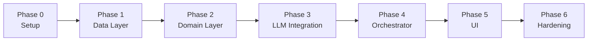

# Phase-Wise Implementation Plan

This plan turns [problemStatement.md](./problemStatement.md) and [architecture.md](./architecture.md) into ordered, shippable phases. Each phase ends with a **demoable milestone** before moving on.

**Reference stack (v1):** Python 3.11+, `datasets` / `pandas`, `pydantic`, Streamlit **or** FastAPI, **[Groq](https://groq.com/)** LLM via OpenAI-compatible API (`openai` SDK), `python-dotenv`.

---

## Plan Overview



| Phase | Name | Primary layer | Problem-statement workflow step |
|-------|------|---------------|--------------------------------|
| 0 | Project foundation | — | — |
| 1 | Data ingestion | Data | 1. Data Ingestion |
| 2 | Filtering & preferences | Domain | 2. User Input (models) + 3. Integration (filter half) |
| 3 | LLM recommendation engine | Integration | 3. Integration (prompt) + 4. Recommendation Engine |
| 4 | Application orchestration | Application | End-to-end logic (no UI) |
| 5 | Presentation | Presentation | 5. Output Display |
| 6 | Quality & delivery | All | Success criteria |

**Estimated duration (solo developer):** ~2–3 weeks part-time, or ~5–7 focused days full-time.

---

## Phase 0 — Project Foundation

### Goal

Runnable repo, dependencies, configuration, and folder layout matching architecture §6.

### Tasks

- [ ] Initialize Python project (`src/` layout per architecture).
- [ ] Add `requirements.txt`: `datasets`, `pandas`, `pydantic`, `python-dotenv`, UI choice (`streamlit` **or** `fastapi` + `uvicorn`), LLM SDK (`openai` — Groq exposes an OpenAI-compatible chat API).
- [ ] Create `.env.example` with `HF_DATASET_NAME`, `LLM_PROVIDER=groq`, `LLM_API_KEY` (Groq API key), `LLM_BASE_URL`, `LLM_MODEL`, `MAX_CANDIDATES_FOR_LLM`, optional `DATA_CACHE_PATH`.
- [ ] Add `.gitignore` (`.env`, `data/processed/`, `__pycache__`, `.venv`).
- [ ] Implement `src/config.py` — load settings from environment with sensible defaults.
- [ ] Add minimal `README.md`: setup, env vars, how to run (placeholder until Phase 5).
- [ ] Choose UI for v1 (Streamlit recommended for speed) and document in README.

### Deliverables

| Artifact | Path |
|----------|------|
| Config module | `src/config.py` |
| Env template | `.env.example` |
| Dependencies | `requirements.txt` |
| Docs stub | `README.md` |

### Acceptance criteria

- Virtual environment installs without errors.
- `from src.config import settings` works; missing Groq `LLM_API_KEY` fails gracefully with a clear message when LLM is needed (Phase 3+).

### Depends on

Nothing.

---

## Phase 1 — Data Layer (Ingestion & Store)

### Goal

Load the Hugging Face dataset once, preprocess into canonical `Restaurant` records, and serve them from an in-memory store (optional disk cache).

Maps to **problem statement § Data Ingestion** and **architecture § 4.1**.

### Tasks

- [ ] **Explore dataset** — load `ManikaSaini/zomato-restaurant-recommendation` in a notebook or script; document actual column names and sample values in a short comment in `preprocessor.py` or `docs/dataset-notes.md`.
- [ ] **Define models** — `src/models/restaurant.py`:
  - `Restaurant` with `id`, `name`, `location`, `cuisines`, `rating`, `cost_for_two`, `budget_tier`, `attributes` (optional).
  - `BudgetTier` enum: `low`, `medium`, `high`.
- [ ] **Loader** — `src/data/loader.py`:
  - `load_raw_dataset() -> Iterable[dict]` using `datasets.load_dataset`.
  - Handle download errors; support reading from `DATA_CACHE_PATH` if configured.
- [ ] **Preprocessor** — `src/data/preprocessor.py`:
  - Map raw columns → `Restaurant`.
  - Normalize location (trim, compare key).
  - Split cuisines on `,`, trim tokens.
  - Parse rating and cost; skip or flag invalid rows per policy.
  - Assign `budget_tier` using thresholds (tune after exploring distribution).
- [ ] **Store** — `src/data/store.py`:
  - `RestaurantStore` with `load()`, `get_all()`, `get_by_id(id)`.
  - Singleton or module-level instance loaded at startup.
- [ ] **Optional cache** — write/read `data/processed/restaurants.parquet` to skip re-preprocessing.
- [ ] **Smoke script** — CLI or `if __name__ == "__main__"` in loader: print row count, sample cities, cuisine count.

### Deliverables

```
src/models/restaurant.py
src/data/loader.py
src/data/preprocessor.py
src/data/store.py
tests/test_preprocessor.py   (optional but recommended)
```

### Acceptance criteria

- Store contains > 0 restaurants after load.
- Every record has non-empty `id`, `name`, `location`.
- Budget tiers assigned for rows with valid `cost_for_two`.
- Reloading app uses cache when file exists (if cache implemented).

### Depends on

Phase 0.

### Milestone demo

Run smoke script: *"Loaded N restaurants; Bangalore: M; cuisines: …"*.

---

## Phase 2 — Domain Layer (Preferences & Filtering)

### Goal

Validate user preferences, apply hard filters, cap candidates for LLM, and build compact candidate DTOs.

Maps to **User Input (validation)** and **Integration Layer (structured filter)** in the problem statement.

### Tasks

- [ ] **Preference model** — `src/models/preferences.py`:
  - `UserPreferences`: `location`, `budget`, `cuisine` (optional), `min_rating` (optional), `additional_preferences` (optional list), `top_k` (default 5, max 10).
  - Pydantic validators per architecture § 4.2.
- [ ] **Filter service** — `src/domain/filters.py`:
  - Pipeline: location → budget → cuisine → min_rating.
  - Case-insensitive location and cuisine matching.
  - Return `FilterResult(candidates, message)`; empty list when no match.
  - Truncate to `MAX_CANDIDATES_FOR_LLM` by rating desc, then name.
- [ ] **Candidate builder** — `src/domain/candidates.py`:
  - `to_candidates(restaurants) -> list[dict]` minimal JSON-serializable payloads with `id`.
- [ ] **Recommendation models (partial)** — `src/models/recommendation.py`:
  - `FilterResult`, placeholder for full response (completed in Phase 4).
- [ ] **Unit tests** — `tests/test_filters.py`:
  - Known fixture restaurants; assert filter combinations and empty results.
  - Assert truncation when input > MAX.

### Deliverables

```
src/models/preferences.py
src/models/recommendation.py  (partial)
src/domain/filters.py
src/domain/candidates.py
tests/test_filters.py
```

### Acceptance criteria

- Invalid `budget` or empty `location` raises validation error.
- Filters never return restaurants violating location, budget, cuisine, or min_rating.
- Zero-match path returns message and does **not** require LLM (orchestrator will enforce in Phase 4).
- Candidate JSON includes only fields needed for prompts.

### Depends on

Phase 1 (`RestaurantStore` populated).

### Milestone demo

Script: load store → apply sample preferences → print candidate count and first 3 candidate dicts (no LLM).

---

## Phase 3 — LLM Integration Layer

### Goal

Prompt construction, LLM invocation, JSON parsing, and validation of `restaurant_id` against candidates.

Maps to **Recommendation Engine (LLM)** and prompt design in **architecture § 4.3**.

### Tasks

- [ ] **LLM client** — `src/llm/client.py`:
  - Abstract `LLMClient.complete(system, user) -> str`.
  - Concrete implementation: **Groq** chat completions via OpenAI-compatible client (`base_url=https://api.groq.com/openai/v1`).
  - Env: `LLM_PROVIDER=groq`, `LLM_API_KEY` (Groq key), `LLM_MODEL` (e.g. `llama-3.3-70b-versatile`), optional `LLM_BASE_URL`, timeout ~30s, retry once on transient failure.
- [ ] **Prompts** — `src/llm/prompts.py`:
  - `build_messages(preferences, candidates, top_k) -> (system, user)`.
  - System: assistant role, JSON-only, use only listed restaurants.
  - User: preferences JSON + candidates JSON + ranking instructions + response schema example.
- [ ] **Parser** — `src/llm/parser.py`:
  - Strip markdown code fences.
  - Parse to `LLMRecommendationResult` (`summary`, `recommendations[{restaurant_id, rank, explanation}]`).
  - Reject unknown `restaurant_id`; sort by `rank`.
  - Optional: one retry prompt on parse failure.
- [ ] **Pydantic schemas** for LLM output in `src/models/recommendation.py`.
- [ ] **Unit tests** — `tests/test_parser.py` with fixture strings (valid JSON, fenced JSON, invalid ids).
- [ ] **Manual integration test** — script with mock or real API using 3–5 hard-coded candidates (small cost).

### Deliverables

```
src/llm/client.py
src/llm/prompts.py
src/llm/parser.py
tests/test_parser.py
```

### Acceptance criteria

- Parser accepts valid model output and rejects ids not in candidate set.
- Prompt includes explicit “do not invent restaurants” constraint.
- Real Groq API call (manual) returns parseable JSON for a toy candidate list.

### Depends on

Phase 2 (candidate shape and preferences model).

### Milestone demo

Run integration script: fixed preferences + 5 candidates → print ranked explanations and summary.

---

## Phase 4 — Application Layer (Orchestrator)

### Goal

Single entry point wiring validation → filter → candidates → LLM → merge with store → `RecommendationResponse`.

Maps to full **system workflow** minus UI.

### Tasks

- [ ] **Complete response model** — `src/models/recommendation.py`:
  - `RecommendationItem` (rank, name, cuisines, rating, estimated_cost_for_two, budget_tier, location, explanation).
  - `RecommendationResponse` (summary, preferences_used, recommendations, meta).
- [ ] **Orchestrator** — `src/services/recommender.py`:
  - `get_recommendations(preferences: UserPreferences) -> RecommendationResponse`.
  - Steps per architecture sequence diagram § 4.4.
  - Empty filter: return empty recommendations + message, **no LLM**.
  - Merge: enrich LLM rows from `RestaurantStore` by id; never take name/rating/cost from LLM text.
  - `meta.candidates_considered`, `meta.model`.
- [ ] **Logging** — filter count, LLM latency, parse failures (stdlib `logging`).
- [ ] **CLI entry** — `src/main.py` or `scripts/recommend.py`:
  - Accept JSON preferences via stdin/args for testing without UI.
- [ ] **Integration test** — mock `LLMClient` returning fixed JSON; assert full response shape.

### Deliverables

```
src/services/recommender.py
src/models/recommendation.py  (complete)
src/main.py or scripts/recommend.py
tests/test_recommender.py     (mocked LLM)
```

### Acceptance criteria

- End-to-end call from preferences to `RecommendationResponse` without UI.
- Display fields (name, rating, cost) match store, not LLM hallucination.
- Invalid preferences propagate as clear errors.
- LLM failure surfaces user-safe error after retry.

### Depends on

Phases 1–3.

### Milestone demo

CLI: *"Bangalore, medium, Italian, min 4.0"* → JSON response with top 5 and summary.

---

## Phase 5 — Presentation Layer (UI)

### Goal

User-facing app: preference form, submit, loading state, results cards, empty and error states.

Maps to **Output Display** and **architecture § 4.5**.

### Tasks

- [ ] **Wire startup** — on app load, initialize `RestaurantStore` once (Streamlit `cache_resource` or FastAPI lifespan).
- [ ] **Preference form**:
  - Location (text or select from distinct cities in store).
  - Budget (select: low / medium / high).
  - Cuisine (text or select).
  - Minimum rating (slider 0–5).
  - Additional preferences (multiselect or comma-separated tags).
  - Top K (optional, default 5).
- [ ] **Submit handler** — call `get_recommendations`; show spinner during LLM call.
- [ ] **Results view**:
  - Summary at top.
  - Cards/expanders per recommendation: name, cuisine, rating, estimated cost, explanation.
  - Show `meta.candidates_considered` in sidebar/footer (optional).
- [ ] **Empty state** — friendly message when filters return zero rows.
- [ ] **Error state** — validation errors, Groq/LLM timeout, missing API key.
- [ ] **Update README** — install, `.env`, run command (`streamlit run src/main.py` or `uvicorn`).

### Deliverables

```
src/main.py          (Streamlit pages or FastAPI routes + minimal HTML)
README.md            (run instructions)
```

### Acceptance criteria

- Non-technical user can submit preferences and read recommendations in browser.
- All problem-statement output fields visible per restaurant.
- No API key in frontend (if FastAPI, keys server-side only).

### Depends on

Phase 4.

### Milestone demo

Full demo: form → AI recommendations with explanations (record screenshot for submission).

---

## Phase 6 — Hardening, Testing & Delivery

### Goal

Meet success criteria in problem statement; repo ready for review or submission.

### Tasks

- [ ] **Expand tests** — preprocessor edge cases, full filter matrix, orchestrator with mock LLM.
- [ ] **Tune constants** — budget thresholds, `MAX_CANDIDATES_FOR_LLM` from real filter counts.
- [ ] **Prompt iteration** — 3–5 real preference scenarios; refine prompt if rankings feel off (still grounded in candidates).
- [ ] **Error handling audit** — table in architecture § 8; verify each scenario.
- [ ] **`.env.example` + README** — troubleshooting (HF download, Groq API key, rate limits, empty city).
- [ ] **Optional** — `Makefile` or `scripts/` for `test`, `run`, `lint`.
- [ ] **Final checklist** — run through success criteria below.

### Deliverables

- Test suite green.
- Documentation complete.
- Optional: short `docs/demo-scenarios.md` with example inputs.

### Acceptance criteria (from problem statement)

| Criterion | Verification |
|-----------|----------------|
| Preferences reduce candidates before LLM | Log/meta shows `candidates_considered` < total in city |
| Recommendations match location, budget, cuisine, rating | Manual spot-check + filter unit tests |
| Each result has preference-aware explanation | UI shows explanation field |
| End-to-end flow demonstrable | Phase 5 demo |

### Depends on

Phase 5.

---

## Cross-Phase Traceability

| Problem statement | Architecture component | Phase |
|-------------------|------------------------|-------|
| Load HF dataset | Loader, Preprocessor, Store | 1 |
| Extract name, location, cuisine, cost, rating | Preprocessor, Restaurant model | 1 |
| Collect location, budget, cuisine, min rating, extras | UserPreferences, UI form | 2, 5 |
| Filter on user input | Filter service | 2 |
| Prepare data for LLM | Candidate builder | 2 |
| Prompt for rank + justify | Prompt builder | 3 |
| LLM rank & explain | LLM client, Parser | 3 |
| Optional summary | LLM schema + UI | 3, 5 |
| Display name, cuisine, rating, cost, explanation | Merge + UI | 4, 5 |

---

## Suggested Implementation Order (Critical Path)

1. Phase 0 → 1 (data must exist before filters).
2. Phase 2 (filters testable without API cost).
3. Phase 3 (can develop parser with fixtures before live API).
4. Phase 4 (unblocks UI).
5. Phase 5 (user-visible value).
6. Phase 6 (parallelize some tests during 4–5 if timeboxed).

---

## Risks & Mitigations

| Risk | Mitigation |
|------|------------|
| Dataset columns differ from assumptions | Phase 1 exploration task first; adjust mapper |
| LLM returns non-JSON | Strict prompt + parser retry + tests with fixtures |
| LLM invents restaurants | Parser id validation; UI reads store fields only |
| Too many candidates → cost/latency | `MAX_CANDIDATES_FOR_LLM` + rating truncation (Phase 2) |
| HF download slow/blocked | Cache parquet locally; document offline path |
| No Groq API key for grading | Mock client for tests; document obtaining a free Groq key at [console.groq.com](https://console.groq.com/) |

---

## Definition of Done (Project v1)

- [ ] All phases 0–6 acceptance criteria met.
- [ ] README explains setup and run.
- [ ] At least: `test_preprocessor`, `test_filters`, `test_parser`, `test_recommender` (mocked LLM).
- [ ] Live demo: user preferences → top recommendations with AI explanations.
- [ ] Out-of-scope items (accounts, live Zomato API, payments) not started.

---

## Post-v1 Backlog (Optional Phases)

| Phase | Feature | Architecture reference |
|-------|---------|----------------------|
| 7 | FastAPI REST + separate frontend | § 4.5 FastAPI option |
| 8 | Embedding-based pre-retrieval | § 11 Extension points |
| 9 | Recommendation caching | § 11 |
| 10 | User feedback on explanations | § 11 |

---

## References

- [problemStatement.md](./problemStatement.md)
- [architecture.md](./architecture.md)
- Dataset: https://huggingface.co/datasets/ManikaSaini/zomato-restaurant-recommendation
- Groq: https://console.groq.com/docs/overview
