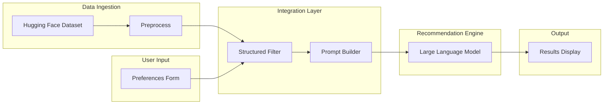

# AI-Powered Restaurant Recommendation System (Zomato Use Case)

## Overview

This project builds an **AI-powered restaurant recommendation service** inspired by Zomato. The system suggests restaurants that match a user’s preferences by combining **structured restaurant data** with a **Large Language Model (LLM)**. Structured filtering narrows the candidate set; the LLM ranks options and produces natural-language explanations so recommendations feel personalized and easy to understand.

## Problem We Are Solving

Choosing where to eat involves many constraints—location, budget, cuisine, ratings, and situational needs (e.g., family-friendly, quick service). Traditional search or static filters return long lists without explaining *why* a place fits. We address this by:

1. **Grounding recommendations in real data** — a public Zomato-style dataset with names, locations, cuisines, costs, and ratings.
2. **Respecting explicit user preferences** — hard filters on location, budget, cuisine, and minimum rating before any AI step.
3. **Using an LLM for ranking and narrative** — the model reasons over a curated subset of restaurants and returns ranked picks with human-like explanations, not just raw rows.

The outcome is a service that is **accurate** (data-backed), **transparent** (each pick includes an AI-generated reason), and **usable** (clear presentation of top recommendations).

## Objectives

Design and implement an application that:

- Accepts user preferences (location, budget, cuisine, minimum rating, and optional extras).
- Loads and preprocesses a real-world restaurant dataset.
- Filters and prepares relevant records for the LLM.
- Uses an LLM to rank restaurants and explain why each recommendation fits.
- Displays results in a clear, user-friendly format.

## Data Source

| Item | Detail |
|------|--------|
| **Dataset** | [ManikaSaini/zomato-restaurant-recommendation](https://huggingface.co/datasets/ManikaSaini/zomato-restaurant-recommendation) on Hugging Face |
| **Ingestion** | Load dataset, clean/preprocess, and extract fields such as restaurant name, location, cuisine, cost, rating, and other fields needed for filtering and display |

## System Workflow

### 1. Data Ingestion

- Load the Zomato dataset from Hugging Face.
- Preprocess records (normalize text, handle missing values, parse cost/rating as needed).
- Retain fields required for filtering, ranking context, and UI display.

### 2. User Input

Collect preferences including:

| Preference | Examples |
|------------|----------|
| **Location** | Delhi, Bangalore |
| **Budget** | low, medium, high |
| **Cuisine** | Italian, Chinese |
| **Minimum rating** | e.g., 4.0+ |
| **Additional** | family-friendly, quick service, etc. |

### 3. Integration Layer

- Apply structured filters to the dataset based on user input.
- Build a compact, structured representation of candidate restaurants for the LLM (names, cuisines, ratings, costs, and other salient attributes).
- Design a prompt that instructs the LLM to reason over candidates, rank them, and justify each choice against the stated preferences.

### 4. Recommendation Engine (LLM)

The LLM should:

- **Rank** filtered restaurants by fit to user preferences.
- **Explain** why each recommended restaurant matches (location, budget, cuisine, rating, extras).
- **Optionally summarize** the overall set of choices (e.g., variety of cuisines or price bands in the shortlist).

### 5. Output Display

Present top recommendations with at least:

- Restaurant name  
- Cuisine  
- Rating  
- Estimated cost  
- AI-generated explanation  

## High-Level Architecture

## Success Criteria

- Preferences reliably reduce the candidate set before LLM invocation.
- Top recommendations align with stated location, budget, cuisine, and rating constraints.
- Each displayed result includes a clear, preference-aware explanation from the LLM.
- The end-to-end flow—from dataset load to displayed recommendations—is demonstrable and maintainable.

## Out of Scope (Initial Phase)

Unless explicitly added later:

- Live Zomato API integration or real-time availability/booking.
- User accounts, saved history, or collaborative filtering across users.
- Production-scale deployment, auth, and payment flows.

## References

- Dataset: https://huggingface.co/datasets/ManikaSaini/zomato-restaurant-recommendation
